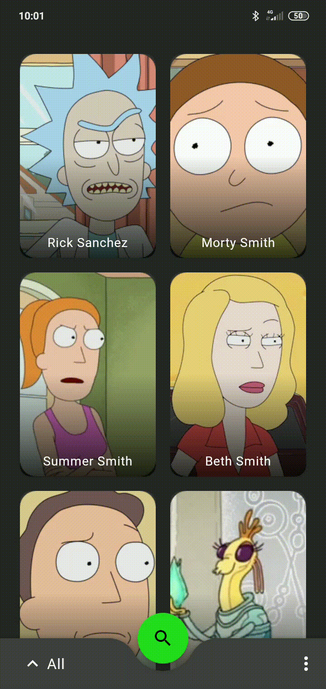
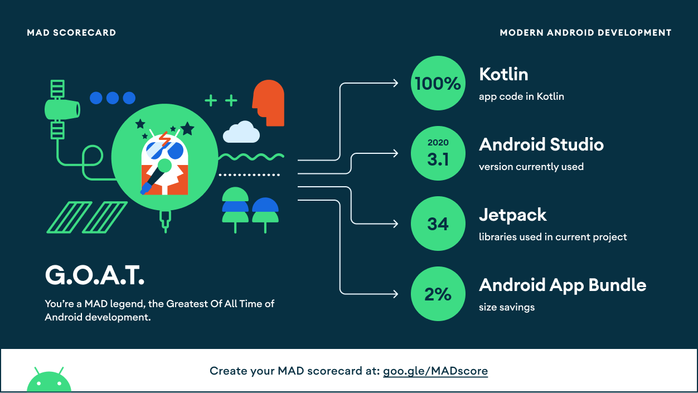

# TechnicalTest-RickAndMorty

## :scroll: Description
Technical test - Rick and Morty character list.
Clean Architecture | MVVM | Hilt | Navigation Component | Paging

## :camera_flash: Screenshots
### Dark and Light mode support

 

### Material Motion Transitions

## MAD Scorecard

Check the full MAD scorecard [here](https://madscorecard.withgoogle.com/scorecard/share/2923638038/).

